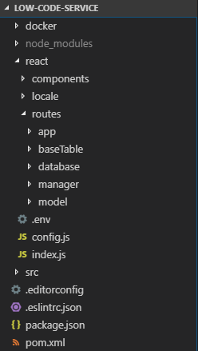
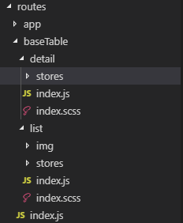
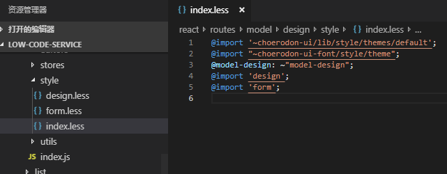

## Choerodon前端规范（初版）

### 目的

出于加快开发流程，提高代码质量，减少不必要的沟通和方便修改他们的代码等目的，制定用于Choerodon猪齿鱼平台前端的开发规范。

正如React约定Hooks函数必须以“use”命名开头，来减少一些问题，可能来自于某种灵感，“不如通过增加一些约定，彻底解决状态共享问题吧！”

我们就以约定来解决部分我们遇到的问题。

*注：下文所列的规则可能部分在今后的开发中被验证为是不正确或不合理的，请与我们联系并修订它。*

### 目录

- [项目结构]()
- [开发方式]()
- [DataSet相关]()
- [参考]()

### 项目结构

现阶段目录结构由于遗留问题（gulp监听复制触发编译）导致层级很深，其实已经不必要了。

现目录结构遵循`一切从简，该分才分`的思想，以`low-code-service`为例，大体如下：



1. package.json中的main字段表示当前项目的入口，统一命名为`./lib/index.js`，当@choerodon/boot版本高于0.9.0后，在启动时会自动将lib路径改为react路径，所以不需要手动修改

2. 1中提到的`./lib/index.js`（开始时的`./react/index.js`)为路由路口文件，按菜单来进行分治，指向routes（原则上一个菜单一个文件夹）中的子路由文件或页面本身

```js
// ./react/index.js

import React, { Component } from 'react';
import { Route, Switch } from 'react-router-dom';
import { inject, observer } from 'mobx-react';
import { asyncLocaleProvider, asyncRouter, nomatch } from '@choerodon/boot';
import { ModalContainer } from 'choerodon-ui/pro';

const Model = asyncRouter(() => import('./routes/model'));
const BaseTable = asyncRouter(() => import('./routes/baseTable'));
const Database = asyncRouter(() => import('./routes/database'));
const Manager = asyncRouter(() => import('./routes/manager'));
const App = asyncRouter(() => import('./routes/app'));

function LowCodeIndex({ match, AppState: { currentLanguage: language } }) {
  const IntlProviderAsync = asyncLocaleProvider(language, () => import(`./locale/${language}`));
  return (
    <IntlProviderAsync>
      <div>
        <Switch>
          <Route path={`${match.url}/model`} component={Model} />
          <Route path={`${match.url}/base-table`} component={BaseTable} />
          <Route path={`${match.url}/database`} component={Database} />
          <Route path={`${match.url}/manager`} component={Manager} />
          <Route path={`${match.url}/org-model`} component={Model} />
          <Route path={`${match.url}/app`} component={App} />
          <Route path="*" component={nomatch} />
        </Switch>
        <ModalContainer />
      </div>
    </IntlProviderAsync>
  );
}

export default inject('AppState')(LowCodeIndex);
```

3. 如果没有跨层级的页面（拥有相同菜单名的页面，在不同层级下表现差距很大需要分成两个页面对待的）不再设立类似orginiazation和project类似的层级目录

4. 除非跨页面使用的stores，否则不单独设立顶层stores目录，各个页面的stores由各自进行管理



5. 页面组件，工具函数都放在本页面目录下，除了一些跨页面使用组件或公用组件，尽量达到“一个目录一个页面，可迁移可删除”的目的

6. 文件夹命名小写开头，常用的包括（routes：表示按菜单或路由划分的模块，locale：多语言处理，components：跨页面使用的组件等），组件命名大写开头，使用驼峰

7. 如果一个文件夹下只有一个index.js和组件文件，且index.js只起传递作用，则删除index.js并且把组件文件命名为index.js

### 开发方式

1. 对纯展示组件，尽可能写函数组件

2. 可引入hooks开发（但对于增删查改型表格表单，使用dataset可以很好地完成开发不需要引入hooks）

3. 对复杂页面上，根据逻辑或位置块进行组件划分，不仅方便后期改造，定位bug，还能优化性能，不要把过多的代码全部写在一个文件里，或者写在一个方法里

4. 所有样式文件从sass改为less

5. 当样式文件很多时，可以设立style目录，由index.less去import其他文件



6. 所有颜色值使用变量，尤其是主题色或主题色相关的，必须使用@primary-color方便后期进行主题替换

```css
& &-add-button {
  position: absolute;
  top: 0;
  right: .08rem;
  opacity: 0;
  color: @primary-color;
  margin-right: 0;
  transition: opacity .3s @ease-in-out;
  z-index: 1;
}
```

7. 所有px单位改为rem，计算方式为px/100

8. 尽量少写类似ul，li等原生标签的样式，因为不能保证后面会不会加入这些标签，样式覆盖会使代码变得很臃肿

9. 引入c7n-prefix和intlPrefix和prefixCls作为命名前缀，便于今后可能出现的改造

```css
// in css

.@{c7n-prefix}-menu {
  border-right: none;
  &-item {
    padding: 0 .08rem 0 .1rem !important;
    &-group-title {
      padding-left: .1rem;
    }
  }
}
```

```js
const intlPrefix = 'global.model.design';
const prefixCls = 'model-design';

<div className={`${prefixCls}-pull-right`}>
<FormattedMessage id={`${intlPrefix}.${designType}.header.title`} />
```

10. 渲染类函数使用render开头，比如renderTable，renderItems，renderHeader

11. 事件处理类函数使用handle开头，比如handleClick，或直接使用事件命名，如refresh，save，cancel

12. 工具函数使用get，set开头

#### 说明
- 处理事件，handle或者on起头，agile使用**handle**
  - 如处理用户输入, handleChangeInput(), onInputChange()
  - 处理点击按钮事件, handleClickBtn(), onBtnClick()
  - handleFilter(), onFilter()
  - handleSelect(), onSelect()

- get方法，用于获取部分参数,渲染体或者dom节点
  - getMaxNumber()
  - getDefaultSelection()
  - getRecordKey()
  - getOption()
  - getData()
  - getFooterContent()
  - getPopuoContainer()

- render方法，把较为独立的部分拆分出来，方便定位和修改逻辑
  - renderList()
  - renderHeader()
  - renderList()

- 自定义事件名要求带有强烈的语义性,如
  - isSorted()
  - isFilterChanged()
  - hasPagination() 
  - resetData()
  - prepareParamsArguments() // Get pation, filters, sorter
  - focus()
  - blur()
  - saveData()

- 对于函数名看不出具体含义，或者逻辑比较复杂的，写上注释，并且列举可能情况方便修改

13. 使用async/await处理异步处理，使用try-catch

```js
try {
  const res = await axios.get();
  // resolve
} catch (err) {
  // reject
}
```

14. 注意有些情况下Promise.all的使用来避免请求阻塞


15. 使用[classnames](https://github.com/JedWatson/classnames)库来处理条件判断生成classname的情况，如果比较简单也可用三元判断

```js
// simple
<li className={active ? 'active' : null} />

// complex
const classString = classNames(`${prefixCls}-form-editor`, {
  dragging,
});
<li className={classString} />
```

16. 使用[query-string](https://github.com/sindresorhus/query-string)库来处理url请求中的数据获取情况

17. 引用其他文件时，不写以`jsx`等结尾的后缀，因为编译后jsx文件不存在（被编译为js）会导致找不到文件而报错，如果只有单文件，直接在index.js中开发

18. 根据提供的lint处理代码，特殊情况可使用disabled跳过某些规则

19. 必须配置husky进行检查

```json
"scripts": {
  "lint-staged": "lint-staged",
  "lint-staged:es": "eslint",
},
"lint-staged": {
  "react/**/*.{js,jsx}": [
    "npm run lint-staged:es"
  ],
  "react/**/*.{scss, less}": "stylelint"
},
"husky": {
  "hooks": {
    "pre-commit": "lint-staged"
  }
}
```

### DataSet相关

1. dataset在组件内部实例化，除非dataset要跨多个页面使用，stores中的文件是dataset的config，暴露一个plain object，可以是一个函数，接收部分通过调用时传进去的值，比如intlPrefix

2. 如果只是简单的增删查改操作，使用transport完成api的管理（下面代码只是个例子，如果返回的结果不是带list的对象，需要自己转化）

```js
transport: {
  read: {
    url: `/lc/v1/organizations/${orgId}/view/${code}`,
    method: 'get',
    transformResponse: data => ({
      list: get(JSON.parse(data), 'base.fields'),
    }),
  },
},
```

3. 原先的零散状态管理，如tab页选中状态，loading与否等，可以用一个dataset，`autoCreate为true`来进行管理

```js
export default (intl, intlPrefix) => {
  return {
    autoQuery: false,
    paging: false,
    selection: false,
    autoCreate: true,
    fields: [
      { name: 'filter', type: 'string', default: undefined },
      { name: 'active', type: 'string' },
      { name: 'expand', type: 'boolean', default: false },
    ],
  };
};
```

### 参考

- [AlloyTeam前端规范](http://alloyteam.github.io/CodeGuide/)
- [eslint](https://cn.eslint.org/docs/rules/)
- [stylelint](https://stylelint.io/)
- [可参考的css指南](https://github.com/cssdream/css-creating#)
- [classnames](https://github.com/JedWatson/classnames)
- [query-string](https://github.com/sindresorhus/query-string)
- [choerodon/pro dataset](https://choerodon.github.io/choerodon-ui/components-pro/data-set-cn/)
